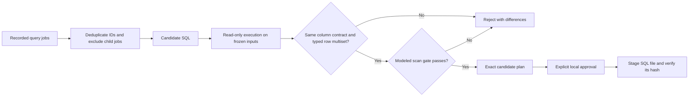

# Governed Query Optimizer

A runnable SQL optimization lab that rejects a cheaper query when it changes the answer. It combines query-workload intake, duplicate-sensitive result comparison, explicit cost-evidence labeling and approval-bound local staging.

**Author:** [Amir Ebrahim](https://www.linkedin.com/in/amirebrahim/) · Senior Analytics Engineer

The engineering problem is simple: shortening a date range, dropping repeated rows or filling nulls can reduce a scan while quietly changing a business metric. A compiler check and a lower byte estimate do not catch that. This project makes correctness a prerequisite for considering the cost improvement.

The default lab's data, query history and cost estimates are synthetic. Its SQL comparison executes against a frozen SQLite fixture. Those byte estimates demonstrate the decision policy; they are not measured BigQuery scans or realized savings. A separate [bounded BigQuery experiment](benchmarks/bigquery/README.md) adds warehouse dry-run estimates, actual uncached job statistics and duplicate-sensitive comparisons on a frozen public-data snapshot. It does not change the local lab's evidence type or approval policy.

## Start here

**Measured public-data proof:** [native BigQuery result and method](examples/bigquery-measurement-2026-10-06.md). Six uncached jobs return the same 10,123-row typed multiset. Both versions process 5,894,360 bytes; the experiment finds no scan reduction. Fixture estimates remain synthetic.

| Reader | Useful starting point |
|---|---|
| Recruiter or hiring manager | The behavior table below and the [generated demonstration report](examples/demo-report.json) |
| Analytics engineer | [Original revenue query](src/governed_query_optimizer/fixtures/original_revenue.sql), [preaggregated candidate](src/governed_query_optimizer/fixtures/preaggregate.sql), and [result comparison](src/governed_query_optimizer/engine.py) |
| Data/platform engineer | [Approval-bound staging](docs/design.md), [negative-path tests](tests/test_engine.py) and [CI](.github/workflows/ci.yml) |

## What the demonstration proves

| Candidate | Behavior | Engineering point |
|---|---|---|
| Preaggregate item values before joining order headers | Eligible after equal results and the fixture cost gate | Preserve the original date cohort and itemless-order behavior |
| Remove historical dates | Blocked despite a smaller estimate | Less data is not an equivalent optimization |
| Add `DISTINCT` to repeated item values | Blocked | Compare row multiplicity, not only distinct sets |
| Replace `NULL` with a sentinel | Blocked | Missing values and categorical defaults have different meanings |
| Equivalent results without enough modeled cost improvement | Blocked | Correctness and benefit are separate gates |
| Execute a write statement | Blocked before mutation | Candidate evaluation stays read-only |



## Run it

Python 3.12 or newer is sufficient. The runtime uses the standard library and needs no cloud account, database server or model API key.

```text
python -m pip install -e ".[dev]"
python -m governed_query_optimizer demo --output artifacts/demo
python -m pytest -q
```

These commands work from the repository root in PowerShell, Bash or a terminal on macOS/Linux. A virtual environment is recommended. The output directory must be new: completed evidence is preserved rather than overwritten.

The demo prints one `ELIGIBLE` candidate and five `BLOCKED` candidates, writes `report.json` and creates an unapproved `safe_plan.json`. A successful demo exit means the expected acceptance and rejection cases reproduced. It does not mean every candidate passed.

### Review and stage one candidate

```text
python -m governed_query_optimizer plan preaggregate --output artifacts/review/plan.json
python -m governed_query_optimizer approve --plan artifacts/review/plan.json --actor demo-reviewer --output artifacts/review/approval.json
python -m governed_query_optimizer stage --plan artifacts/review/plan.json --approval artifacts/review/approval.json --output artifacts/staged-query
```

Read the plan before approving it. Approval covers its exact SQL, fixture hashes, case contract and evaluation. Changing any of those invalidates the approval. Staging writes a local SQL file and verifies the bytes read back; it does not create a cloud view or run a production job.

The approval file is an explicit local attestation. It demonstrates content binding, not authenticated identity or a tamper-proof authorization service. A production integration would need a trusted approval store and identity enforcement.

To inspect a rejected candidate:

```text
python -m governed_query_optimizer evaluate short_window
```

Exit code `0` means the requested operation completed. Exit code `1` means a candidate or operation was blocked. Argument errors use code `2`. A blocked evaluation is expected for the unsafe examples.

## Engineering decisions

- **A row multiset instead of `EXCEPT DISTINCT` alone.** The same value can legitimately occur more than once. A `Counter` compares typed rows and occurrence counts, retaining duplicates and distinguishing nulls from substitutions.
- **An explicit output contract.** Column names and order must match. Values compare exactly, including integer versus floating-point type. Monetary examples use integer cents. This intentionally conservative policy avoids a hidden tolerance changing financial meaning.
- **One frozen input state.** Original and candidate read the same in-memory fixture. The result proves equivalence for that fixture, not for all possible future inputs.
- **A read-only execution boundary.** SQLite's authorizer allows reads only from the two fixture tables and a small set of deterministic aggregate/scalar functions. Writes, schema access, database attachment and unapproved functions fail. Row and execution budgets bound candidate evaluation.
- **No double-counted query history.** Repeated job IDs are deduplicated; conflicting repeats fail. Child jobs and failed/incomplete records are excluded. A fixture-supplied logical workload ID groups recurring jobs. This is not a general SQL-fingerprinting implementation.
- **Separate evidence types.** Evaluated rows are executable proof; supplied bytes are synthetic estimates. The project does not multiply an assumed daily saving by 365 or report an annual realized outcome.
- **Approval survives only unchanged inputs.** Staging re-evaluates and re-hashes the plan against the current packaged case. An eligibility field cannot simply be edited to bypass the evaluator.

## Tests and reproducible evidence

The suite covers expected candidate verdicts, duplicate loss, null changes, column/type contracts, reordered rows, write and metadata access, nondeterministic functions, multi-statement input, query budgets, invalid estimates, cost increases, modified approvals, replay prevention and parent/child job double counting. [CLI tests](tests/test_cli.py) exercise the full demo and explicit approval/staging sequence.

[CI](.github/workflows/ci.yml) runs the same offline tests and demonstration on Python 3.12 and 3.14. It needs no secrets. [Examples](examples/) contains output generated by the repository commands, with synthetic origin and limitations retained.

## Scope and extension points

The [BigQuery experiment](benchmarks/bigquery/README.md) compares a fixed original/preaggregation pair in the target dialect, on the same time-travel snapshot. It distinguishes estimated, processed and billed bytes and reports three samples per query. Its measurements are an experiment, not an automatic cost-benefit verdict or generalized adapter for arbitrary SQL.

The implemented project evaluates recorded SQL candidates. Proposals can be authored by an analyst, a rule engine or an AI tool; a live LLM proposal service is not implemented here. The demonstration's preaggregation rewrite is deliberately small enough to inspect completely.

The default evaluator does not establish BigQuery/Snowflake dialect equivalence, privacy isolation for arbitrary production databases, ordering equivalence for a top-N consumer, performance on warehouse-scale data or stability on unseen data. SQLite and exact fixture comparisons are its local proof boundary; the separate BigQuery experiment establishes only its fixed pair's observed snapshot results and job measurements.

For a real warehouse adapter, preserve the same contract while adding a consistent source snapshot, target-dialect compilation, duplicate-aware comparisons at scale, approved numeric tolerances, actual dry-run/job statistics, trusted identity, least-privilege credentials and an explicit deployment workflow. Do not substitute a narrower business date window for a faster implementation of the same request.

## Repository map

```text
src/governed_query_optimizer/
  engine.py       result comparison, cost policy, job intake, plan/staging guards
  cli.py          demo, evaluate, plan, approve and stage commands
  fixtures/       invented orders/items, recorded proposals and synthetic job history
tests/            engineering and command-flow regression cases
examples/         generated public demonstration evidence
docs/design.md    contracts, state transitions and production adaptation questions
```

The design is inspired by warehouse performance investigations and governed analytics delivery. This public implementation and its fixtures were written for this project; no employer SQL, identifiers, reports, credentials or data are included. Code is provided under the [MIT license](LICENSE).

Related work: [analytics warehouse](https://github.com/PharaohFresh/analytics-engineering-portfolio) · [governed delivery and lineage](https://github.com/PharaohFresh/agentic-analytics-delivery) · [revenue reconciliation](https://github.com/PharaohFresh/revenue-reconciliation-pipeline).
